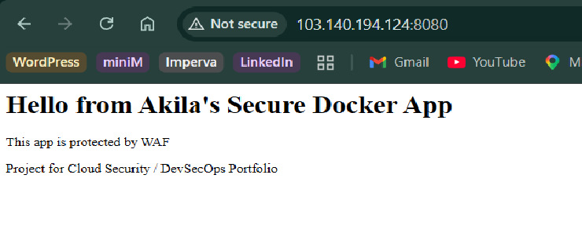

# Secure Docker + WAF Demo

**Project for Cloud Security & DevSecOps Portfolio**

This project demonstrates a secure web application deployment using Docker and Nginx configured as a basic Web Application Firewall (WAF).

### Features
- Containerised Nginx web application
- WAF protection with rate limiting and security headers
- Docker Compose for easy deployment
- Proper network isolation and restart policies

### Technologies Used
- Docker & Docker Compose
- Nginx (as both App and WAF)
- Linux security concepts (rate limiting, security headers)

### Architecture
Browser → WAF Layer (Nginx with security rules) → Application Container

### How to Run
```bash
docker compose up -d

### Deploymnet Images
